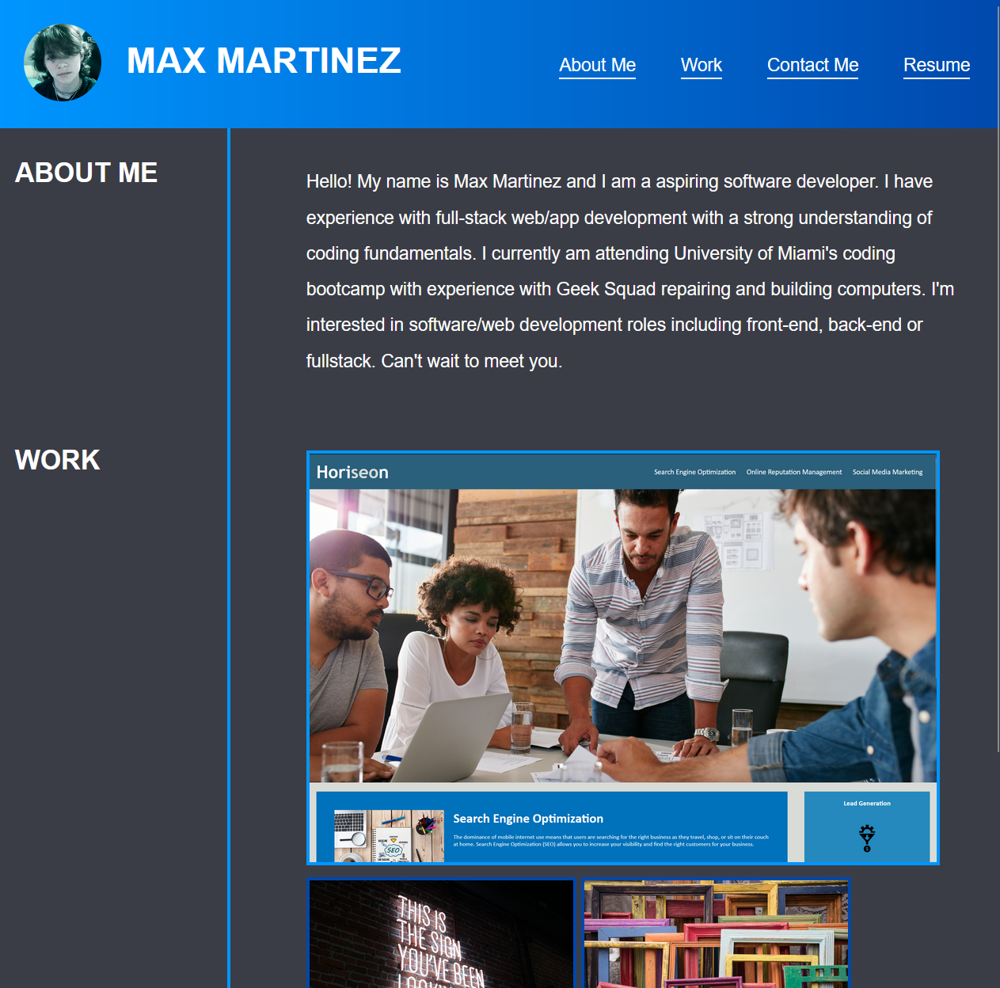
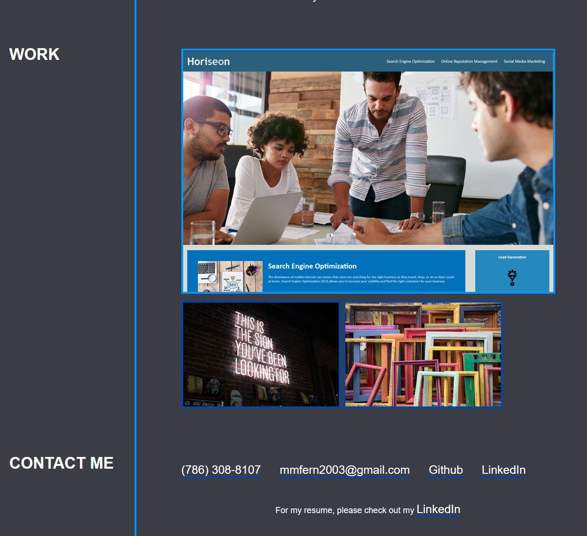

# Web Portfolio for Max Martinez.

## Description

This is a personal portfolio used to display to potential employers for my skills and abilties when it comes to web development. Here I will showcase my best projects, about me, and ways to contact me. This portfolio will constantly be worked on to include up to date projects and information.

## Usage

Media queries were used in this project to make this page accessible to everyone on any device. I also added comments to my code so if anyone wants to see how and/or why I did something, there are comments describing the code and its purpose.

## Images

## Link

This page was deployed using Github Pages. If you would like to visit, [click here](https://beyondneptune.github.io/portfolio/).